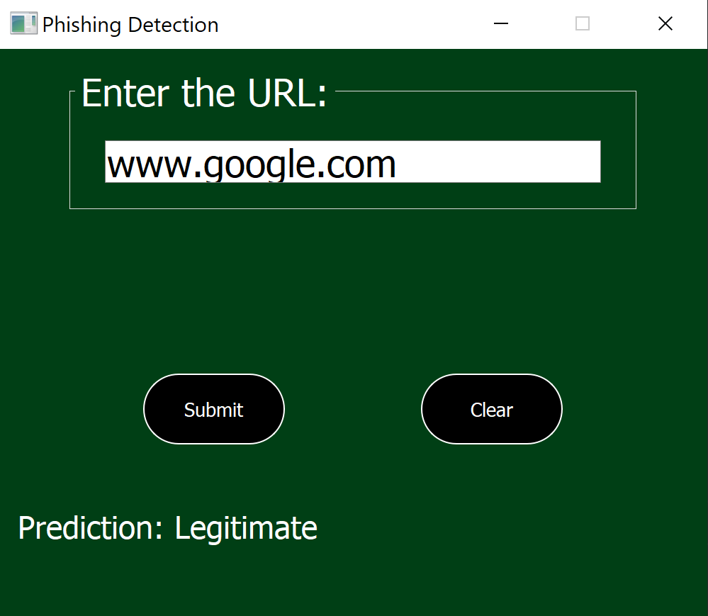

# Phishing Website Detection

## Overview

This project aims to determine whether a website is for phishing purposes. The structural characteristics of the URL and
the content of the site are evaluated to make predictions about whether the site is legitimate or phishing based on a
trained dataset.

## Project Structure

- **app.py**: Website prediction application with simple ui
- **train.py**: ML model selection/creation scripts
- **url_prep.py** : Python script containing functions for preparing url for prediction.
- **dataset/phishing.csv**: Dataset used for training model. Original
  dataset: https://www.kaggle.com/datasets/shashwatwork/web-page-phishing-detection-dataset
- **images/**: Confusion matrix, ROC-AUC curve, and feature importance graphs that measure model performance.

## Requirements

Make sure to install the required packages before running the script:

```bash
pip install -r requirements.txt
```

The required packages are:

- pandas==2.1.1
- pyqt5==5.15.10
- matplotlib==3.8.2
- joblib==1.2.0
- scikit-learn==1.3.0
- lightgbm==4.1.0
- xgboost==1.7.3
- requests==2.31.0
- beautifulsoup4==4.12.2
- python-whois==0.8.0

## Usage

1. **Clone the repository:**

```bash
git clone https://github.com/hllibrkaya/phishing_website_detection.git
cd phishing_website_detection
```

2. **Install the required packages:**

```bash
pip install -r requirements.txt
```

3. **Run the script**

```bash
python app.py
```

## User Interface

